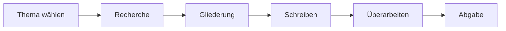

# Willkommen im Wiki: Studien- & Abschlussarbeiten

> Dieser Wiki-Entwurf zeigt **Inhalt** + **GitHub-Wiki-Features** in einem.

## 📌 Schnellstart

- [Leitfaden: Struktur einer Arbeit](Struktur-einer-Arbeit)
- [Formalia & Formatierung](Formalia-und-Formatierung)
- [Wissenschaftliches Arbeiten](Wissenschaftliches-Arbeiten)
- [Typische Fehler & Checklisten](Typische-Fehler-und-Checklisten)
- [Vorlagen & Ressourcen](Vorlagen-und-Ressourcen)
- [FAQ](FAQ)
- [Glossar](Glossar)

---

## 🎯 Zielgruppe

Dieses Wiki richtet sich an:

1. Studierende im Bachelor/Master
2. Studierende vor der ersten Haus- oder Seminararbeit
3. Studierende kurz vor der Abgabe, die eine Qualitätskontrolle brauchen

---

## 🧭 So nutzt du dieses Wiki effektiv

1. Lies zuerst **Struktur einer Arbeit**.
2. Nutze dann **Formalia & Formatierung** parallel in deinem Schreibprozess.
3. Prüfe vor Abgabe die **Checkliste**.
4. Bei Unsicherheiten: **FAQ** + **Glossar**.

---

## 🔎 Feature-Demo: Was GitHub-Wikis können

- Interne Links zwischen Seiten (siehe Schnellstart oben)
- Tabellen
- Tasklisten
- Codeblöcke (z. B. für LaTeX)
- Zitate (Blockquotes)
- Bilder und Diagramme
- Ankerlinks innerhalb langer Seiten

### Beispiel: Taskliste für den Endspurt

- [ ] Titel geprüft
- [ ] Forschungsfrage klar formuliert
- [ ] Zitationsstil einheitlich
- [ ] Verzeichnis vollständig
- [ ] PDF exportiert und final gegengelesen

### Beispiel: Mermaid-Diagramm (falls im Repo/Wiki unterstützt)

> Hinweis: Wenn Mermaid in deinem Ziel-Setup nicht gerendert wird, kann das Diagramm als Codeblock stehen bleiben oder als Bild eingebunden werden.

---

## 📅 Pflegeprozess (für dich als Maintainer)

- Neue Hinweise pro Semester ergänzen
- Stilrichtlinien der Fakultät aktualisieren
- Häufige Betreuer-Feedbacks als FAQ übernehmen

